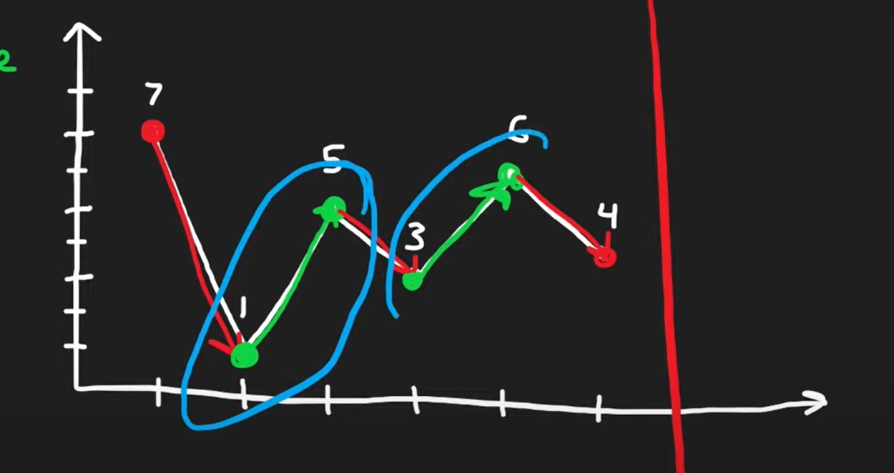

# BestTimetoBuyandSellStock2
I could not arrive to a solution even after trying, then after watching editorials, i understood the greedy solution

1. Greedy
The beauty of this solution was that it kept checking for nearest pairs number, and at each iteration it changed the  start value regardless we found a pair or not. I think its a pattern in itself and it should be definitely remembered. It even solved this scenario beautifully 1 3 5, where 3-1 and 5-3 would ewssentially be same as 5-1.
    After watching neetcode  i also understand it more clearly
    

    Basically we have to buy only when we have a positive slope. we could straight up just take the difference of adjacent elements and sum up the positve ones and it would work.

    My second solution basically dictates that.

