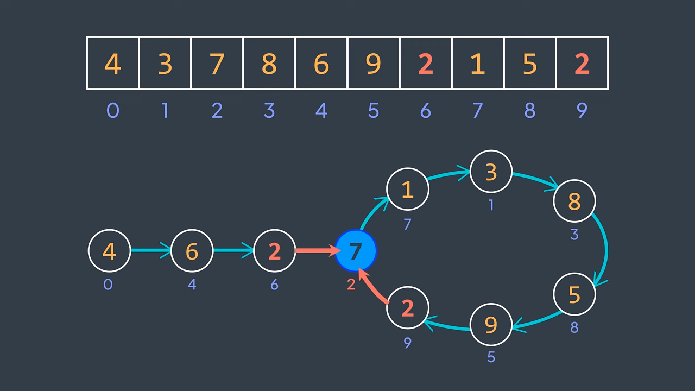

# FindTheDuplicateNumber
I tried solving solving it using hashmap, but that introduced space complexity 
Then i learned the floyd algorithm for cycle detection, which solves this problem in O(N) time 
and O(N) space complexity. 
Link: https://youtu.be/PvrxZaH_eZ4?si=QUKrMPo0umpgD6Qs
